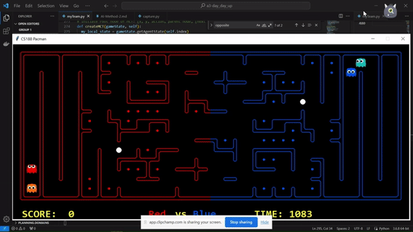
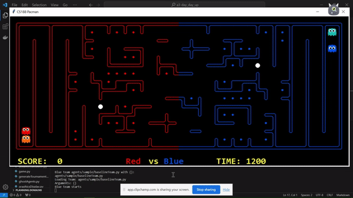
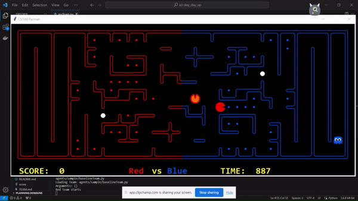
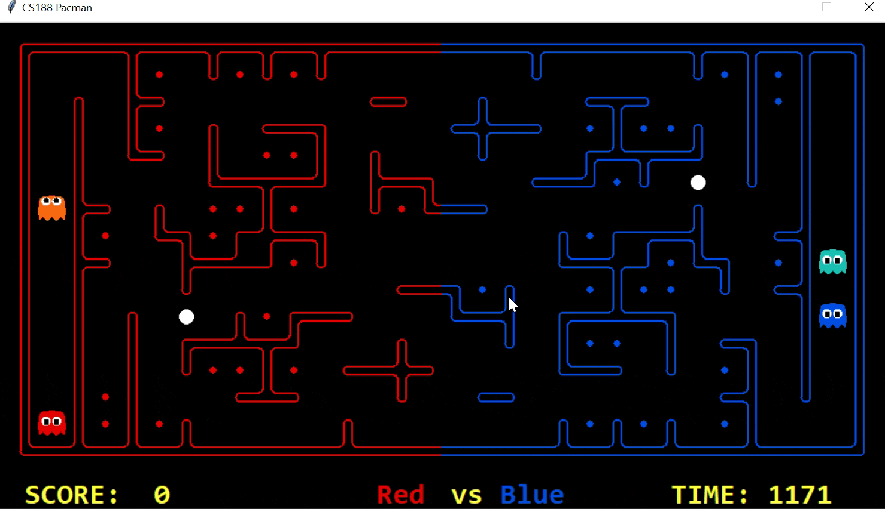
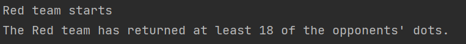

# Evolution of the approach

## Monte-Carlo Tree Search
----
The MCTS Agent can be executed from the file myTeam_MCTS.py in the agents folder.

The Collector agent employs the Monte-Carlo Tree Search (MCTS) technique as its strategic framework to compete in the Pac-Man gameplay. Throughout its developmental journey, the agent's intelligence continually evolves, with a specific emphasis on the exploration of the MCTS methodology. This development path is marked by the successful resolution of several challenges.

The algorithm was first constructed from the innovation of identifying the optimal move within the current observed stat. Subsequently, the MCTS design underwent a series of refinements, gradually enhancing the algorithm's sophistication from its initial release. As the codes often runs into infinite loop, thus impeding convergence, recording the linked list was a highly effective approach to mitigate the problem. Additionally, the parameters such as a threshold of tree iteration and discount factor are set up to ensure the error-free execution of the program.
However, following these critical set up of the algorithm, the agents still lacked the requisite level of intelligence to compete effectively within the game environment due to the inherent limitation of MCTS. In particular, these agents exhibited redundant behaviour by meandering aimlessly when distant from rewards and fail to leave long corridors when the game starts. As shown below:

#### Cannot leave corridor

Hence, in order to make agents act more decisive, A* search is adopted to let agent moves to a goal when the environment is safe. Moreover, turn back action is prohibited to minimize redundant movements unless an empty dead end is detected. This strategic augmentation has proven particularly beneficial for optimizing agent performance at the commencement of the game and when it comes to efficiently collecting food. The improvement is demonstrated in the below GIF animation.

#### Start with A*

The initial deployment of the agent on the server is to evaluate its performance on varying map scales and against an array of diverse enemy types. Once these initial tests were successfully executed without errors, additional features are applied and developed in the algorithm.

#### Competition results: Games - 4-0-5

In order to enhance the agent's adaptability to various games, more parameters are established and adjusted: threshold is set to the proportion of the size of the map; learning rate is set to 0.2 to maintain calculation stability; a relatively lower discount factor (0.9 – 0.95) to accommodate distant and less conspicuous rewards; maximum food capacity carried by an agent is relative to the food available of a game to balance efficiency and survival rate.

Furthermore, the reward structure further enhances the algorithm’s configurability, allowing for both defensive and aggressive strategic preferences to be accommodated. The value of rewards is stored in a list [food, power capsule, pacman enemy, invincible enemy, boundary] and it is exclusive to each individual agent. When the algorithm is executed, adjusting rewards also impacts each agent’s behaviour when preconditions and priorities of the current state changed. Additional rare scenarios are considered to guarantee the agents act rationally at all time.

#### Efficiently collecting food

#### Competition results: Games - 10-1-26

In conclusion, the Collector agent evolved to become more intelligent and versatile in the Pac-Man game, capable of making better decisions and adapting to different gaming scenarios.

#### Strategy summary

| Pros | Cons |
|-----------------|:-------------|
| Adaptive to changing state | Uncertainty involved in random simulation  |
| Consider multiple scenarios     | Invalid simulation leads to extra computational cost          |
| Configurable to adjust strategy | Performance of parameters setting for different games may vary |

----
## A* Approach 
----
The A* Agent can be executed from the file myTeam.py in the agents folder.

The base ai technique of A* search are used to find the closet path between agent current location and the location of food capsule or enemy.
### First Version

#### Offense Agent
In the first trail the abilities of the offense agent is as follows
1 The Agent twill cross the middle line and decide the path for agent to entre that can not be caught by the enemy agent who are defending.
2 As agent entre enemy’s field it will calculate the current distance between the it self and the capsule and food. The one with smaller distance will be choose as the target(capsule or food)
3 Agent will escape form the enemy. The idea is realize by adjust the input problem for the a* search function. By adding the walls into the location where enemy located, the a* search will avoid the path that contains the enemy since it sees the location of enemy as walls.
4 The enemy will chase the scared enemy as it eat the capsule.
5 When the agent eat the food that exceed the maximum capacity or reach the global goal it will return to the base.

#### Defense Agent
In the first trail the abilities of the agent is as follows
1. The defense agent will attack as the offense agent when there is no agent in its own field.
2. When the agent detect enemy’s agent mode changes(from ghost to pacman) it will return to base and patrol along the middle line
3. When the defense agent detect the enemy it will chase the enemy agent until it been destroyed.

By testing, it reveals a bad result, this is due the the over aggressive of defense agent, and the logic of adding wall on the enemy’s location in the search problem in offense agent.

### Second Version 
Fixed logic:

1. The main adjustment: Instead of adding walls in the search problem, the action that lead the agent with 1 unit distance with the enemy will be banned when selection the successor action.

2. The defense agent will not attack the enemy. It has been adjust to the fully defense mode.

In this approach the agent has improved in the below point:

1. the agent has improve on the ability of escaping from enemy’s chase. Since the wall adding logic will banned the optimal path in extreme map and circumstances. In Banning action type for each round the agent will be much more flexiable.

2. By observation the previous defense agent which can attack is not a good idea. The attack from enemy’s agent will be aggressive when the defense agent go attacking and go back to defense will waste a lot of time and reduce the efficiency. By removing the logic of attacking of the defense agent, it will focus on patrol and chase the detected enemy which improves a lot on the performance of the whole agent group.

## Approximate Q-Learning 
----
The Approximate Q-Learning Agent can be executed from the file q_learning_myteam.py in the agents folder.

The approximate Q-Learning evolution is generally base on the adjustment of feature design and reward setting.

### Development Process
Feature design: the number of food gain 
Rewards: Score of the game

During the development process, the agent are not able to avoid the chase of the enemy defense and the reward have bias. By using simply one feature in approximate q learning is not suitable for complex situation, it can not avoid the chase and the target selection is random which is not efficient. The reward of score does not reflect the true reward of the attack q learning agent, The score will reflect the condition on both side red and blue it does not truly reflect the current agent performance.

### Improvement
Feature design: Two features are added. The closest distance to food and the current number of foods carrying. The distance feature is able to help the agent to get a food target which have the lowest distance. The number of food carrying feature keeps the agent the improve the number of food carrying and avoid the action that lead the reduce of the number of food carrying.

By making those adjustment the performance has improved. Still, compare to the A* approach, its performance is not that good.

----
## Multiplayer with A* Search Algorithm
----
The Multiplayer with A* Search Agent can be executed from the file multiplayer.py in the agents folder.

In the journey of developing the Multiplayer A* Star Search algorithm, we faced multiple challenges and complexities, and it was necessary to design an intelligent multi-person collaboration strategy to ensure that multiple agents can coordinate their actions and find the optimal solution path.

In the early stages of the development process, the main implementation was the A* search algorithm. This includes setting up search problems, computing heuristic functions, handling node expansion, etc. After the A* search algorithm is designed, it already has the ability to successfully complete the game, but the scoring efficiency is not very high.

Therefore, we began to consider adding Multiplayer logic to the A* search algorithm to make its decision-making more dynamic and adjust decisions more efficiently. However, we soon encountered the challenge, which was how to deal with multiple agents, because in the game, we not only need to consider our own agent, but also the opponent agent. This requires designing a strategy to coordinate the actions of multiple agents. The final strategy was to add a strategy based on the existing A* search algorithm to adjust its own actions based on the actions and position of the opponent agent. However, during the initial design phase of this strategy, we encountered the problem of being unable to exit from the corridor. As follows: 

Through research, it was found that this problem occurs because the agent cannot detect the enemy's location, or the agent's detection object has not yet appeared. Therefore, the agent just randomly selects actions, resulting in the inability to leave the corridor. After discovering this problem, we changed a certain logical sequence so that the agent could leave the corridor first, and then monitor the location of the opponent agent during subsequent navigation. Through this changed deployment, the agent can leave the corridor and have stronger dynamic decision-making capabilities, which leads to a higher winning rate. Shown below:

Competition result:

#### Strategy Summary

| Pros | Cons |
|-----------------|:-------------|
| Dynamic decision-making | More complexity and more resources required|
| Flexible strategy to the target     | Conflict between optimal path selection and action adjustment based on action of opponents        |

[Back to top](#evolution-of-the-approach)