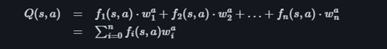
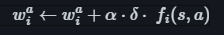

# Aproximate Q-Learning

# Table of Contents
  * [Motivation](#motivation)
  * [Application](#application)
  * [Trade-offs](#trade-offs)     
     - [Advantages](#advantages)
     - [Disadvantages](#disadvantages)
  * [Future improvements](#future-improvements)

## Aproximate Q-Learning
The Aproximate Q-Learning Agent can be executed from the file q_learning_myteam.py in the agents folder.
### Motivation  
In the environment of Pacman game, the agent can be trained and performed in the approximate Q learning algorithm.

Approximate Q-learning is an extended algorithm of Q-learning. Different with original Q-learning, approximate q learning is more efficient on handling the larger and continuous state space. Since realizing Q-learning need to maintain a Q table for each state which is requires huge running time and space complexity. Instead of using Q-table, approximate Q-learning an approximation function is used to estimate Q value, which improve the time and space complexity a lot.

By using approximate q learning, the agent will behave more flexible. Since all the cases are designed based on the features, there is no need to adjust the if else logic.

[Back to top](#table-of-contents)

### Application  
The approximate Q learning are designed to attack in this project.

Functions are screenshot on week8 Notes” Model-free reinforcement learning: Q-learning and SARSA” (canvas): https://gibberblot.github.io/rl-notes/single-agent/function-approximation.html

#### Feature Engineering (selection of feature)
F1 to Fn represents the features for a particular state. Features describes the issues and special information that is significant for agents’ learning. In setting revenant features will generalize the learning of agents across different kinds of situations. In the circumstances of pacman game three features are selected: numbers of food carrying for the specific pacman, number of food gain for pacman and the distance between the pacman and the closest food. 

The general aim for a particular pacman is to eat as much food as it can and also avoiding the enemy’s capture.

The intension of setting the food carrying feature is as follows. To satisfy the aim of eat as much food as pacman can the number of food carrying is a direct feature that keeps the pacman gain number of food rather than other action. Nevertheless, the food carring feature are also designed to prevent the capture of enemy ghost, as the pacman will prevent the actions that will leads the number of food carrying reduce. 

The idea of design the number of food gain is similar with the food carrying feature. The feature simply ensure for each state the selected action will ensure the pacman eat more food (ensure the number of food will increase). Different with the food carrying, the food gain focus on two turns instead of the whole gain process, om other words the foo gain only focues whether the next state of pacman will gain number of food or not.

The design of distance to food feature will keep the agent to chase the closest food(the food which have the lowest distance with agent). 

#### Training mode
Weight of each kind of feature are trained and update based on 30 rounds of the game.
δ represents the temporal difference error, it estimate the different between the current Q value and the temporal state’s Q value. Based on the formula 2, in the use of approximate q learning in this project the weights are dynamically adjusted to a suitable weight, which enhance the performance of the approximate q-learning agent.  

Q(s,a) represent the current estimation of Q value in a given action and a specific state. Q value for each available action and state are calculate as first formula. Features are calculated for each temporal state (temporal state represent the possible state when exuding a particular action)

#### Running mode
As the weight are adjusted by running the training mode to the best adjusted feature weight. The agent is ready to run based on the feature and weight. For the running the features are dynamically change and calculated in each round. Since for different state may contain different situations thus features needs to be calculated. For each action in a given state, actions’ q value are calculated based on the Q-learning approximation function. The action with the highest q value will be chose as the best action.

[Back to top](#table-of-contents)

### Trade-offs  
#### *Advantages*  
1. Approximate q learning are easy to handle large data and state space and save a lot of running time than normal Q learning. Since Q learning need to calculate the Q table which cost a lot of space and time. By using the estimate q function will improve the efficiency.

2. By training and running the pacman agent using approximate q learning will makes the agent to handle several states that are similar. In doing so the agents are more generalized which can handle different cases.

#### *Disadvantages*
The main disadvantages of the approximate q learning is the un-perfect feature selection will lead to a bias. When the feature is not perfectly selected the weight will be training into a bias weight and the action that agent selected will be a bias action, which prevent the agent to reach the ideal goal.

[Back to top](#table-of-contents)

### Future improvements  
1. More features can be designed to train the agent, in doing so the agent will be more flexible that can handle more situations.

2. The defense features are also a good point to improve. In this project the approximate q learning is only used to attack, the approximate q leading are also a good algorithm to defense.

3. Improve by training the weight for more rounds. By more training time an suitable feature will lead to a more accurate weight that improves the performance of the agent.

[Back to top](#table-of-contents)
